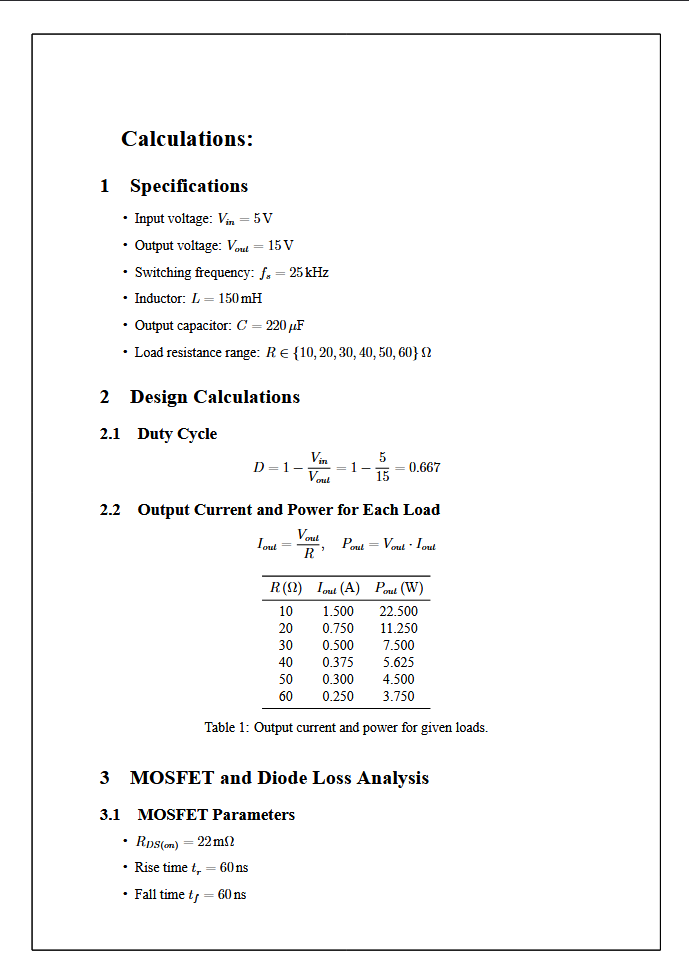
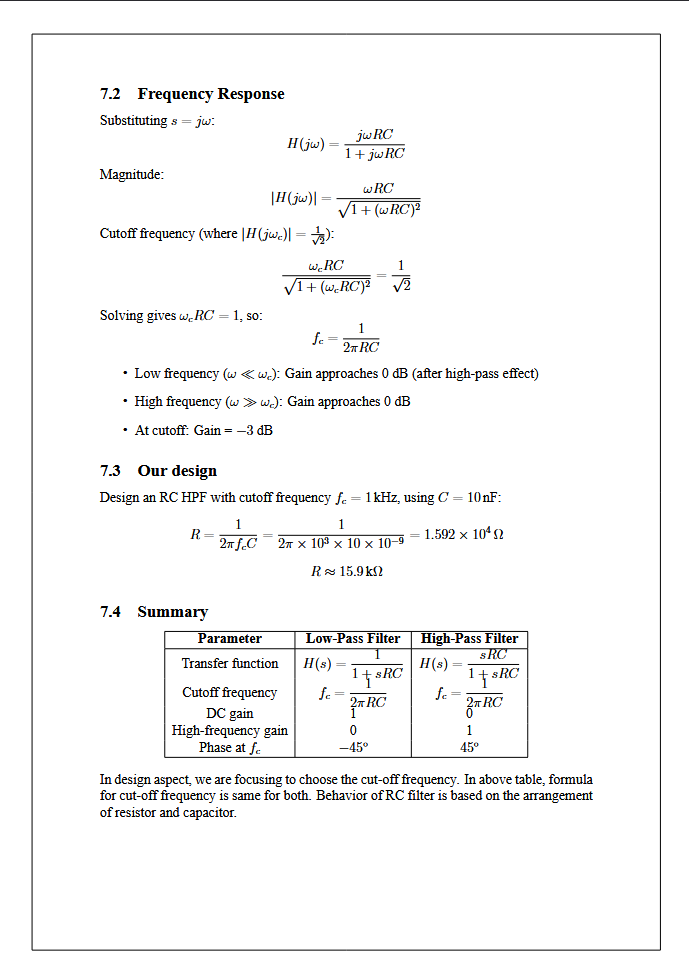

# Who am I?
Hello everyone, I’m **Deventhira Kesavaraj**, currently pursuing **B.E. in Electrical and Electronics Engineering** at **KPR Institute of Engineering and Technology (KPRIET), Coimbatore**, **batch 2024–2028**.

# What is latex?
This is an programming language like python, c and java as more same as markdown but **used to develop a research papers with more and complex math equations**.
I'm new to this but I learned from my first project, which nothing but my internship report. 
Yes, I wrote this entire report using this latex only. If you not trust me see the languages used on this project.

Ok, Now this is one of the favorite languages because using this latex language to create a pdf file as you want because it has that much of freedom to custom your pdf whatever you want. But still I'm new to this one so i agreed, I used chatgpt to generate a initial codes such to import libs. other than i wrote all the context are you seen in this pdf, which is generated using my latex code, because the output of this code generates a pdf. this all my thoughts about this in future i will learn more and more deeper than i will share whatever i done using this latex.

# How to config this one ?

I used this latex with vscode, because vscode is my favorite IDE. Actually, I wrote this entire pdf context on vscode, which makes sounds crazy yet this is I done. 

Step by step instruction
  - Download TexWorks and MiKTex Console from official latex website.
  - and download strawberry Perl, which is more important to install if you using latex with vscode.
  - You already have vscode means no problem if not means install it.
  - then, download LaTeX Workshop by James Yu.
  - after completed all this steps you able to use latex on your vscode(the file extension with .tex)

# You can download my intenship report on releases.

## Sample Images

